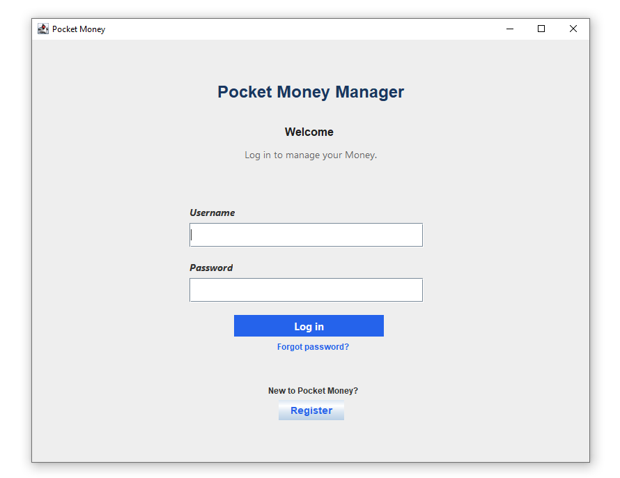
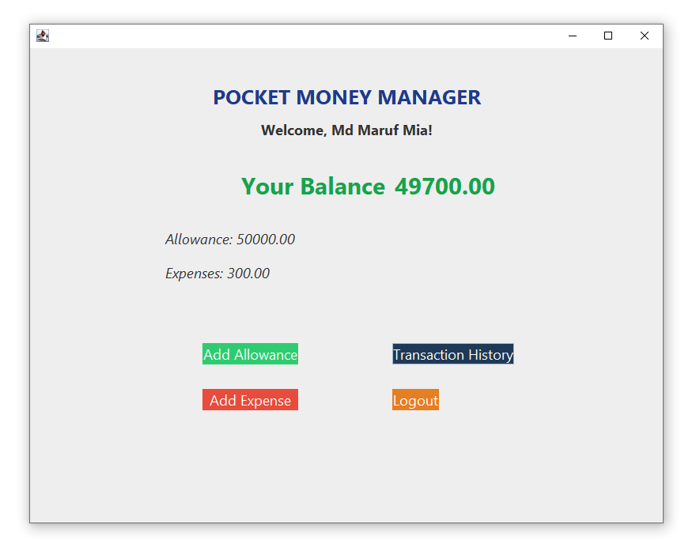
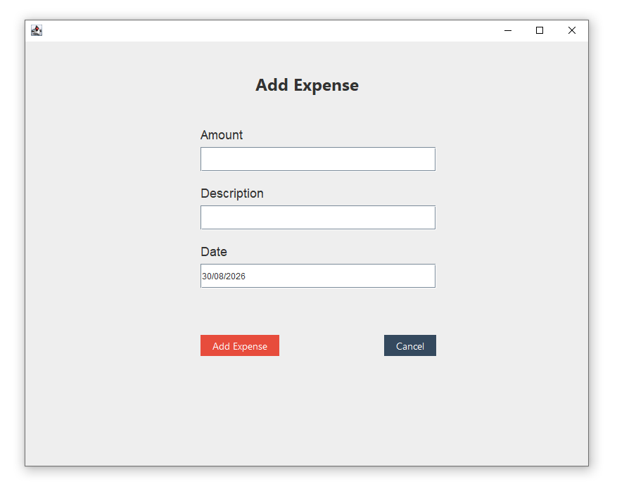
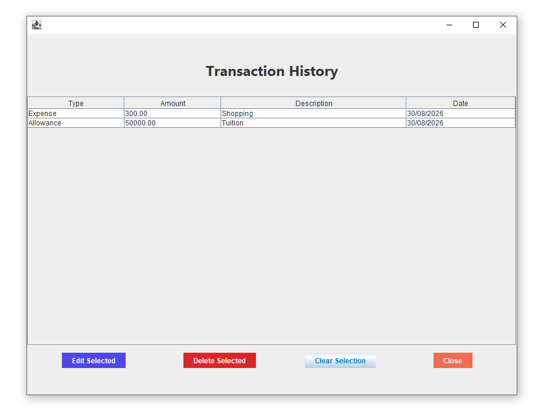

# Pocket Money Manager

A Java-based desktop application for managing pocket money, allowances, expenses, and transactions.

## About the Project

Pocket Money Manager is a desktop application developed using Java and NetBeans.
It provides a simple graphical interface for users to manage their pocket money,
record allowances and expenses, and view and edit transaction history.

## Features

- User Registration
- User Login
- Dashboard
- Add Allowance
- Add Expense
- Transaction History
- Edit Transactions
- Money/Balance Management

## Technologies Used

- Java
- Java Swing
- NetBeans IDE
- GUI Builder
- Object-Oriented Programming (OOP)
  
## How to Run
-Clone this repository.
-Open the project in NetBeans.
-Build the project.
-Run the application.

## Purpose
This project was developed as a learning project to practice Java,
GUI development, object-oriented programming, and application structure.


##  Screenshots

### Login



### Dashboard



### Add Expense



### Transaction History



## Project Structure
```text
src/
└── pocketmoneymanager/
    ├── dashboardandinput/
    │   ├── AddAllowanceFrame
    │   ├── AddExpenseFrame
    │   └── DashboardFrame
    │
    ├── historyandcontrol/
    │   ├── EditTransactionFrame
    │   ├── HistoryFrame
    │   └── PocketMoneyManager
    │
    ├── transactionmanagement/
    │   ├── Allowance
    │   ├── Expense
    │   ├── MoneyManager
    │   └── MoneyRecord
    │
    └── usermanagement/
        ├── LoginFrame
        ├── RegisterFrame
        ├── User
        └── UserManager


### Transaction History


